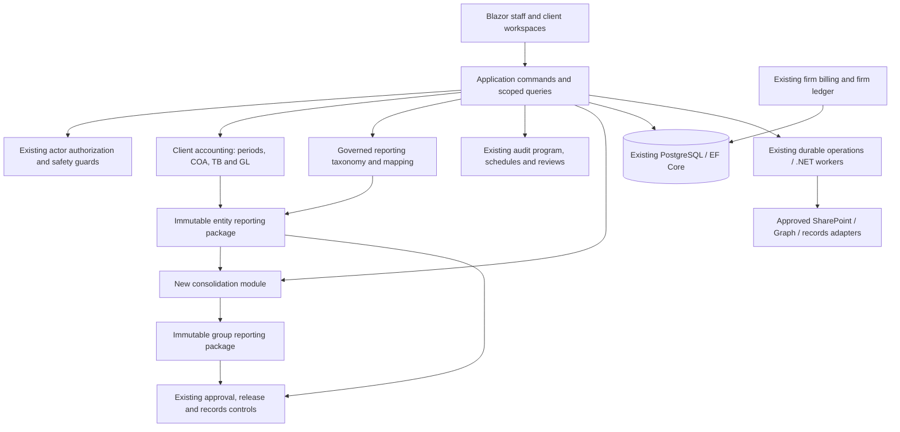

# AuditSphere — Audit-Focused Accounting Module
## Gap Analysis, Agile User Stories and Implementation Roadmap

**Repository:** `nirzaf/AuditSphere`
**Branch inspected:** `master`
**Pinned review commit:** `ed6624e` (current accounting implementation including controlled XLSX formulas, deterministic DOCX/PDF exports and the candidate advanced-method statement fixture; detailed capability evidence remains in `docs/execution/current-slice.md`)
**Commit date / review date:** 22 September 2026
**Deliverable status:** Active product and engineering backlog grounded in the current local implementation; not professional-methodology approval or production acceptance.

---

## 1. Executive decision

**Extend AuditSphere's existing .NET accounting and audit modules. Do not install ERPNext or turn the platform into an operational ERP.** Use ERPNext as a reference for useful accounting concepts and interaction patterns: company-specific account trees, journals, accounting dimensions, financial reports, reconciliation and currencies. Build those concepts around independent client evidence, approved reporting adjustments, exact-version review and group reporting.

Maintain three explicit financial boundaries:

1. **Audit firm's own books:** existing `Practice/FirmLedger` and billing services; firm revenue, staff costs, invoices and receipts.
2. **External client's accounting workspace:** client-owned source TB/GL, client chart of accounts, approved mappings, reporting adjustments, reconciliations and entity financial statements.
3. **Group consolidation workspace:** approved component packages, ownership/perimeter, translation, intercompany differences and consolidation-only journals. These must not change component books.

The current system already has significant reusable accounting and audit infrastructure. The remaining gap is not “add an accounting module from zero.” It is **turn the bounded, single-entity TB-to-package implementation into a governed, multi-client accounting and consolidation product**. External component packs now follow a typed submitted/returned/resubmitted/approved workflow with reconciliation, compatibility-bridge evidence and approved-pack-only consolidation consumption; advanced group methods remain deliberately disabled until their method-specific fixtures exist.

### Scope change that must be recorded

The current v5 specification explicitly limits the first operational profile to single-entity financial statements and says full group consolidation is not an implicit first-release obligation. The user's present request adds consolidation. Record an additive capability/scope decision; do not retrospectively describe consolidation as an already-implemented or previously accepted capability. [R2]

A relationship group is not the same as a consolidation perimeter. A group name organizes clients; a consolidation perimeter identifies which entities and packages belong in a particular reporting exercise under an approved method.

### Current implementation snapshot (2026-09-22)

The accounting workspace now reads persisted in-scope period-linked work tasks for dashboard owner, state and due-date handoffs, falls back to PBC requests when no task is present, links periods without package or mapping records to the exact period workflow, and keeps `Not recorded` when no persisted task/PBC date exists.

The shared shell now provides a keyboard skip link, `:focus-visible` states, and stable `name`/`autocomplete` metadata for discovered form controls while preserving the existing draft fallback behavior.

The local implementation now covers client accounting profiles, periods/books, controlled entity and group period roll-forward, chart-of-accounts mappings, versioned trial-balance profiles and multi-entity batches, typed GL imports, paged account-completeness bridges, source-bound reconciliations, generation-bound ECL/inventory/specialist/analytical evidence, typed payroll/loan/equity/related-party/tax/going-concern forecast schedules, explicit asset-schedule depreciation method/useful-life and closing-balance controls, entity-package projections, restatement lineage, bounded same-currency consolidation with fail-closed receivable/payable, revenue/expense, dividend and investment/equity elimination classification, journal lineage, close checks, immutable financial-package review decisions, package-bound release candidates, completion-screen candidate preparation, typed accounting-evidence links to reviewed audit procedure results, a scoped evidence queue with exact workpaper handoffs, accounting archive lineage, group perimeter/membership/scope/component/elimination/run/rate/translation lineage in structured archive exports, approved-prior-scope group roll-forward lineage, and an accounting dashboard with period status and roll-forward/restatement navigation. Period close is row-locked and package-aware: matching packages must have current management, accounting and partner approval; authorized reopen creates an immutable append-only amendment record and a new working revision. Controlled entity roll-forward creates a new draft period, copies eligible reporting books as drafts, and creates an explicit hash/evidence-bound opening bridge without copying prior approvals. Group roll-forward requires an approved prior scope/run and carries its exact run hash, approved FX lineage hash/reserve, and recurring-elimination manifest without auto-applying prior journals. Package-review decisions are stage-bound, exact package revision/generation/hash-bound, and append-only; release candidates now preserve the `FINANCIAL_PACKAGE` target and re-check the current management, accounting and partner decisions before checkpointed issuance. Accounting evidence captures the relevant client input generation and fails closed when that generation changes; source-bound ECL and inventory evidence also preserves the reconciliation source hash. ECL persists an explicit booked amount and calculates its difference against that amount; ECL and inventory assessments can retain same-engagement proposed-journal lineage. Analytical reviews now retain reporting currency, deterministic input snapshots/replay hashes, movement flags and reviewer conclusions; approved conclusions are required after freshness checks; journal-risk evidence retains sample-selection, management-explanation and corroboration fields. Consolidation perimeter approval now requires an independently accepted group capability profile for the selected method, component approval requires current management, accounting and partner package reviews, and each component submission is bound to the package's period basis, taxonomy version and mapping-version lineage; run publication recomputes current component-package/journal inputs so stale runs must be rebuilt. Group membership changes now advance a durable group revision; scopes pin that revision and reject approval/calculation and all component/translation/match/journal writes after a perimeter change without rewriting historical memberships or runs. The bounded foreign-operation profile additionally pins an approved rate set and translation policy to the scope, accepts only explicit `DIRECT` rate observations, requires maker/checker approval of each foreign component translation, preserves per-line source and FX lineage in the deterministic manifest, and blocks missing or stale rates/packages. A restricted client portal now exposes validated package metadata and statement totals and permits signed-in management acknowledgement without exposing internal review history or workpapers; authorized staff queues expose only the actor's explicit client/engagement scope.

Local verification at `master@ed6624e` is **225/225 PostgreSQL-backed tests passing with 0 skipped**, **83 migrations applied** through `20260922083103_EnableLiveMailProviderAuthority`, a successful loopback restore rehearsal through the same migration, a zero-warning Release build, and no pending EF model changes. QAR remains the default only for blank client accounting/reporting inputs; source/import and FX-policy currencies remain explicit. Deterministic financial-package exports include versioned XLSX, DOCX and PDF profiles with exact-byte persistence, authorized downloads and a runtime-enforced trusted workbook formula allowlist. A fixed candidate fixture produces balanced QAR current and comparative advanced-consolidation statements, but advanced profiles remain disabled until method-owner approval. Local evidence does not establish live Microsoft-provider behavior, professional approval, signing acceptance, production recovery, or independent human review; the detailed capability inventory remains in `docs/execution/current-slice.md` and `docs/execution/status.json`.

---

## 2. Evidence, sources and limitations

### 2.1 Basis

- **D1 — supplied audit process:** `Audit working process - Audit Tool New(1).docx`, eight pages, twenty numbered sections. Section names and procedural scope are preserved in section 5 of this report.
- **R — repository source:** current branch metadata, domain entities, accounting services, audit fieldwork services, and the v5 specification at the pinned commit. See section 13 for immutable references.
- **E — external comparison:** official ERPNext documentation, used only to explain the reference feature set.
- **S — professional context:** IFRS Foundation overview pages for consolidation, business combinations, currency translation and reporting-version considerations. These are context, not a substitute for the firm's approved methodology or complete licensed standards.
- **P — proposed design:** the user stories, new entities, sequence, tests and acceptance conditions below are recommendations, not claims that the sources already implement them.

### 2.2 What this review does and does not establish

This document began as a source-level architecture and product review. Its current implementation snapshot is refreshed from the local repository and execution evidence above. It does not claim professional-methodology approval, live tenant acceptance or a production deployment.

“Present” means the inspected code represents the capability. “Partial” means a useful implementation exists but does not yet satisfy the broader requested behavior. “Not found” refers to the inspected model/service inventory, not to an assertion based only on a failed keyword search. Documentation completion labels and historical test counts are not treated as proof of the newly requested scope.

The newer audit implementation includes `AuditSchedule`, selections, item tests, confirmations, alternative procedures, area assessments and differences. This report does not incorrectly list those as wholly absent. A generic assessment envelope is not, however, the same as an implemented and verified ECL, depreciation, tax or consolidation calculation engine. [R8–R10]

### 2.3 Meaning of “manages the accounts” in this design

The baseline is an **import-first preparation and audit workspace**, not client sales/purchase/payroll operations. A client can retain its external bookkeeping system. AuditSphere imports controlled evidence and maintains reporting/audit adjustments. If the firm later needs full outsourced day-to-day bookkeeping, define that as a separate capability with source-book ownership and operating controls; do not introduce it implicitly through this backlog. [R2]

---

## 3. ERPNext inspiration — what to adopt, adapt and exclude

| ERPNext reference concept | AuditSphere adaptation | Boundary |
|---|---|---|
| Company-specific Chart of Accounts | Independent versioned client COA; optionally map to common firm and group reporting taxonomies | Never force different clients to use identical source account codes. |
| Journal Entry and templates | Balanced, version-bound reporting/audit adjustments, reclassifications and reviewed recurring templates | Proposal, management agreement, review and application are distinct events. |
| General Ledger | Immutable imported transaction detail and a traceable adjusted reporting view | Do not fabricate a client's transaction history from its closing TB. |
| Accounting Dimensions | Import branch, department, cost centre, project, party and intercompany counterparty | Dimensions do not confer authorization. |
| Financial reports and comparative periods | Entity TB, lead schedules, statements, disclosures, account drill-down and prior-year bridges | An arithmetic check is not a professional approval. |
| Bank/payment reconciliation | Reconcile imported client schedules, bank statements and selected subsequent transactions | No client payment initiation or cash-management operations. |
| Multi-currency | Original, functional and presentation currencies; approved immutable rate sets | Transaction remeasurement and foreign-operation translation are different processes. |
| Intercompany Journal Entry | Match component balances and generate approved consolidation-only eliminations | Do not automatically post into each client's source ledger. |
| Consolidated Financial Statement report | Auditable group reporting packs with perimeter, adjustments, eliminations and lineage | A report that sums entities is not evidence of complete consolidation methodology. |
| Fiscal periods and closing | Client reporting-period locks and controlled amendments/rollforward | Do not reuse the firm's own fiscal-period objects as the client's periods. |
| Sales/purchases/stock/payroll operations | Import schedules and supporting evidence for the audit procedures | Exclude ordering, procurement, warehouse movements, payroll disbursement and statutory filing from this module. |

ERPNext's documentation describes a company-specific account tree, accounting dimensions, journal entries, multi-currency and consolidated reporting. These are useful reference concepts, not a claim that ERPNext's documented consolidated report supplies every ownership, acquisition or elimination control required here. [E1–E6]

---

The subsequent `9f8b2a7` web slice adds bounded review-only mapping candidates for unmapped accounts, labels ambiguous matches, and never auto-assigns an allocation.

The `ccb01ea` web slice initially scoped Portfolio counters and release/package lists to active explicit grants; `60c7c68` preserves exact engagement-grant boundaries so an engagement-only grant cannot expand to sibling engagements; `69dc6ec` adds scope-bound client search and CSV export.

## 4. Current-code gap analysis

### 4.1 Capability matrix

| ID | Capability | Current evidence | Gap / recommended action | Priority |
|---|---|---|---|---|
| G01 | Separation of firm and client accounts | `FirmLedger.cs` explicitly separates firm finance from client TB/adjustments. [R3] | Preserve it. Add client account structures rather than extending `FirmAccount` to hold external-company books. | Preserve |
| G02 | Multiple independent clients | `PracticeClient` and firm/client/engagement scoped datasets exist. [R4–R5] | Add client accounting profiles, period/book identity and richer context selection. | P1 |
| G03 | Client grouping and ownership | Inspected client model has no group/ownership/perimeter entities. [R4] | Optional relationship grouping plus separately versioned ownership/control and consolidation scope. | P1/P3 |
| G04 | Client chart of accounts | TB rows contain account codes/names; no first-class client COA/version catalog in inspected accounting model. [R5] | Stable account identities, hierarchy, account type, historical code/name versions and external-system aliases. | P1 |
| G05 | Firm-wide taxonomies | `TaxonomyVersion`, `DestinationCode`, `StatementSection` are strings in mapping/package records. [R5–R7] | Governed taxonomy catalog, approved versions, destination validation, applicability, change impact and group overlays. | P1 |
| G06 | Mapping | Versioned mappings, independent allocation records, fractions and completeness checks exist. [R6–R7] | Mapping workbench; reusable rule packs; explicit maker/checker; exact split residual policy; safe migration between taxonomy versions. | P0/P1 |
| G07 | Source ingestion | CSV parsing, bounds, decimals, one currency, LOADING→SEALED and duplicate detection exist. [R11–R12] | XLSX, import profiles, raw-byte identity, previews, GL import, per-entity batch handling and source-period validation. | P0/P1 |
| G08 | GL / subledger detail | Generic `AuditScheduleRow` can hold dates, amounts and original JSON. [R8–R9] | Typed journal/party/dimension identity and completeness-to-TB reconciliation; not merely free-form schedule JSON. | P1 |
| G09 | No-adjustment entity | `CreatePlanAsync`, `FinalizeAsync` and package recalculation reject plans without journal lines. [R7, R13] | Support a genuine zero-adjustment plan and package, without a dummy journal. | P0 |
| G10 | Audit/reporting journals | Existing AJ and source-reflection plan preserve NOT_REFLECTED / REFLECTED semantics. [R5, R13] | Journal-purpose/book policy, immutable client decisions, approval/reversal flows, optional export and typed links to audit differences. | P1 |
| G11 | Corrected / uncorrected differences | `AuditDifference` now retains typed correction state, optional materiality/qualitative metadata and reviewer evaluation. [R8, R10] | Complete professional aggregate evaluation and final reporting conclusion; exact `journal-impact.v2` and snapshot/source-reflection gates now prevent unsupported verified-reflected status. | P1 |
| G12 | Reconciliation | Source schedule totals, residuals and independent review exist. [R8–R9] | Resolve reference totals from identified TB/GL snapshot; retain explained reconciling items and schedules by area. | P1/P2 |
| G13 | Specialized audit accounting schedules | Area assessments can capture evidence, assumptions, booked/audited/residual amounts. [R8–R9] | Typed reviewed calculators for ECL, inventory valuation, depreciation, payroll/interest samples, equity, tax and forecasting where enabled. | P2 |
| G14 | Reporting periods / comparative / multiple books | Client periods/books, context-bound TB imports and package period/book/basis identity exist; firm periods remain separate. [R3, R5] | Opening bridge, comparative snapshot, close/reopen and restatement history remain the residual scope. | P1 |
| G15 | Financial statements | Adjusted snapshots, mapped package lines, cash-flow inputs, disclosure responses and canonical text artifact exist. [R5–R7] | Approved statement structures, statement of changes in equity, comparatives, note tables, reporting currency, cross-casts and controlled export. | P2 |
| G16 | Multi-currency | Client imports remain single-currency, while the bounded foreign-operation profile now has approved rate sets/policies, pinned scope inputs, maker/checker translation results and per-line FX lineage. [R11, R15] | Add distinct monetary remeasurement, historical/average/closing-rate behavior, translation-reserve rollforward and approved multi-currency fixtures; unsupported hyperinflation/nonexchangeable cases remain blocked. | P4 |
| G17 | Group consolidation | Bounded component, ownership, intercompany, elimination, run and review records exist for same-currency/full-ownership and the pinned foreign-operation profile. [R1–R2, R5, R15] | Add approved NCI, acquisition, ownership-change, nested-group, associate/common-control and complex-elimination methods; never infer them from percentage alone. | P3/P4 |
| G18 | Review, release and evidence | Reuse existing authorization, approvals, generations, release checkpoint and records patterns. [R2, R10] | Extend from entity targets to composite group manifests; prohibit stale component-based release. | P2/P3 |
| G19 | Portfolio usability | Existing Blazor pages and entity workflow should be reused. [R1] | Cohesive client accounting and group workspaces, explicit basis/version, next action, blockers and scoped drill-down. | P1–P4 |
| G20 | Proof and scale | Existing tests are a foundation, not evidence for new group scope. | Real PostgreSQL and browser tests, method-owner golden fixtures, exact-source replay, concurrency and representative workloads. | All phases |

### 4.2 Immediate correctness fixes before extending scope

**C1 — clean engagements cannot take the existing no-adjustment package route.** `AdjustmentPlanService.CreatePlanAsync` and `FinalizeAsync` reject zero plan lines; `FinancialStatementService.CalculateAdjustedBalancesAsync` also rejects them. Support an explicit zero-adjustment plan whose adjusted balances equal the validated source. Test the complete service path, not just the calculator. [R7, R13]

**C2 — “source bytes” are not the current CSV hash input.** The importer hashes a reconstructed sequence of entity, account, amount and currency. It omits account names and mapping codes and is order-sensitive. `TrialBalanceImportService` then uses that hash while reporting identical source bytes. Store a raw upload SHA-256 separately from a versioned normalized-data digest. A renamed account must not be silently discarded as an identical file. [R11–R12]

**C3 — row entity labels and downstream account keys disagree.** The parser detects duplicates by `(Entity, AccountCode)`, allowing the same account code across distinct entity labels. Later adjusted-balance construction keys by `AccountCode` only. Enforce one authorized legal entity per dataset and explicitly split multi-entity import batches. Do not treat changing the dictionary key as the whole isolation fix. [R7, R11–R12]

**C4 — mapping approval needs explicit separation of duties.** The inspected approval method checks authorized reviewer roles, state, version and dataset eligibility, but has no `CreatedByUserId != actor.UserId` check. A qualified user holding both preparation and review roles should not approve their own map under the intended maker/checker policy. Recheck actor state and scope in the commit transaction. [R6]

**C5 — mapping correctness is more than 100% fractions.** Current allocations require nonempty destination/section strings, but those strings are not resolved against an approved taxonomy catalog. Each weighted line is independently normalized; no residual allocation is visible in the calculator. Validate taxonomy membership and preserve the source amount exactly using a deterministic, recorded residual policy. [R6–R7, R14]

**C6 — schedule reconciliation must resolve trusted reference data.** GL-backed bank-ledger schedules now require a sealed, firm/client/engagement/legal-entity-scoped GL import batch whose raw or normalized hash matches the schedule, whose selected account codes have complete case-insensitive source-line coverage, and whose persisted GL control total is derived from those source lines; a caller-supplied mismatch fails closed. Non-GL statement schedules remain separately evidenced and are not silently treated as GL data. [R9]

**C7 — correction claims need typed lineage.** The local difference workflow now links the exact journal revision, source-reflection evidence, adjusted snapshot and a hash-checked `journal-impact.v2` payload, and supports explicit proposed/agreed/rejected/applied/reported states. Stale or unsupported impact evidence blocks verified-reflected status. The remaining gap is the professional aggregate/materiality conclusion and final reporting determination. [R10]

These are source-supported findings and proposed strengthening measures, not claims of a tested production exploit.

---

## 5. Traceability to the supplied twenty-section audit process

The attachment is an audit procedure checklist, not a complete accounting or consolidation specification. Keep its twenty section names and extend accounting support beneath them. Group ownership, firm taxonomies and consolidation originate from the current request, not from unmentioned content in the attachment.

| Source section | Existing reusable support | Additional accounting support / proposed stories |
|---|---|---|
| 1. Planning & Risk Assessment | Audit planning/materiality and program infrastructure; TB/FS source model | Opening-balance bridge, period/source completeness, client profile, mapping and analytical inputs: AC-01, 03–09, 15. |
| 2. Cash & Bank | Schedules, confirmations, responses and alternative procedures | Bank/GL/TB tie-out; dated reconciling items; outstanding-item aging; subsequent statement links: AC-08, 12, 25. |
| 3. Trade Receivables | Schedule/confirmation/selection/test infrastructure | As-of aging, subsequent receipts, ECL inputs and independent recalculation: AC-08, 12–13. |
| 4. Inventory | Schedules, item tests and assessment envelope | Quantity/cost source reconciliation, counts, cost-vs-NRV, obsolescence and cutoff: AC-12–13. |
| 5. Revenue / Sales | Schedules, selections and item evidence | Monthly GL bridge, source dates, credit notes and revenue cutoff: AC-08, 12, 15. |
| 6. Purchases & Trade Payables | Schedule/confirmation/test infrastructure | Payables aging, supplier statements, subsequent payments and unrecorded-liability bridge: AC-08, 12. |
| 7. Fixed Assets | Assessment envelope and evidence links | Asset rollforward, additions/disposals, depreciation and impairment support: AC-14. |
| 8. Expenses | Imported schedules and tests | Prior-year/budget variance, classification, capital-vs-expense and cutoff: AC-08, 12, 15. |
| 9. Payroll | Area assessment and sample testing | Imported payroll-to-GL bridge and selected gross/net/deduction recalculations, not payroll operation: AC-14. |
| 10. Loans & Borrowings | Confirmations and area assessments | Loan rollforward, interest/accrual calculations, current/noncurrent split and covenant inputs: AC-14. |
| 11. Equity / Share Capital | Area assessment and document links | Share/equity rollforward, dividend and retained-earnings bridge: AC-03, 14, 16. |
| 12. Related Parties | Confirmation and assessment model | Typed related-party/counterparty links, balance/transaction schedules and disclosure inputs: AC-08, 14, 20. Related parties are not automatically consolidation members. |
| 13. Tax & Statutory Liabilities | Tax assessment envelope | Approved jurisdiction profile, return/payment/GL bridge, current/deferred-tax schedules where enabled: AC-14, 16. |
| 14. Journal Entries & Fraud | Selection/testing and journal/difference records | Complete imported GL journal register; rule-based flags with human disposition: AC-08, 10–11, 15. |
| 15. Analytical Review | Area-assessment envelope | Defined formula/denominator periods, ratios, monthly trends, budget comparisons and explanations: AC-15. |
| 16. Going Concern | Area-assessment/evidence infrastructure | Versioned management forecasts, debt/cash inputs, scenarios and reviewed assumptions: AC-14–16. Never infer an audit conclusion from ratios alone. |
| 17. Subsequent Events | Evidence and area assessments | Post-year-end transaction search and explicit adjustment/disclosure decisions: AC-08, 11, 16, 26. |
| 18. Financial Statements & Disclosures | Mapped entity packages, cash-flow inputs, disclosures and text artifact | Complete approved presentation, comparative, equity and note consistency: AC-05–06, 16–17, 21–23. |
| 19. Audit Differences & Adjustments | Difference register, AJ and reflection plan | Management decision, exact correction lineage, impact calculations and signed/gross summaries: AC-09–11, 23. |
| 20. Final Completion & Audit Report | Program reviews, completion checks and release/records foundation | Consolidated completion evidence, representation/signing dependencies and exact final TB/FS lineage: AC-16, 23, 25–28. |

Do not replace a source-required procedure with “schedule uploaded.” Receipt, reconciliation, testing, independent review and professional conclusion remain different outcomes.

---

## 6. Target architecture

### 6.1 Logical design



`TAX` above is a reporting taxonomy, not a jurisdictional tax-calculation engine. Use names such as `ReportingTaxonomy` in code to prevent that ambiguity.

### 6.2 Financial data path


### 6.3 Three independent concepts that must not be conflated

**Entity organization:** client, optional relationship group, ownership relationships.

**Accounting basis:** source book, reporting book, management-agreed adjustment layer, presentation reclassification, consolidation-only layer.

**Evidence status:** received, validated, reconciled, reviewed, management accepted, professionally approved, released and protected.

A “balanced TB” only passes a mathematical test. “Management accepted” is not an auditor's opinion. “Sent” is not proof of delivery. “Group member” is not permission to view sibling companies.

### 6.4 Proposed module placement

Keep the current projects and add cohesive folders/classes inside them. Names below are proposed, not existing files.

```text
AuditSphereOps.Domain/
  Practice/                 # existing firm CRM, billing, firm ledger
  Accounting/
    ClientAccounts/         # accounting profiles, client COA versions
    Periods/                # reporting periods and books
    Taxonomies/             # firm reporting taxonomy versions
    Imports/                # typed source batches and GL data
    Reconciliations/        # source-bound accounting schedules
  Consolidation/            # scope, inputs, eliminations, run/results
  Audit/                    # reuse existing fieldwork/program entities
  Reviews/                  # reuse applicability/history patterns

AuditSphereOps.Application/
  Accounting/               # commands, query DTOs and pure calculators
  Consolidation/            # orchestration and pure consolidation engine

AuditSphereOps.Infrastructure/
  Persistence/              # existing DbContext, configurations, migrations
  Providers/                # existing external document/provider boundary

AuditSphereOps.Web/
  Components/Pages/Accounting/
  Components/Pages/Consolidation/
```

Do not reorganize the entire repository merely to achieve this folder structure. Move only code touched by an accepted story. Keep deterministic calculation functions free of EF Core, network calls, clocks and random identifiers, following the current calculator pattern. [R14]

### 6.5 Minimum model extensions

| Domain | Proposed records | Required relationship/control |
|---|---|---|
| Client organization | `ClientAccountingProfile`, `ClientGroup`, `ClientGroupMembership` | Reuse `PracticeClient` as legal-entity identity; effective-dated group membership; no implicit access. |
| Periods and books | `ClientReportingPeriod`, `ClientPeriodAmendment`, `ClientReportingBook`, `OpeningBalanceBridge` | Entity + period + basis; prior-period linkage; approved close/reopen and immutable amendment lineage. |
| Client COA | `ClientChartVersion`, `ClientAccount`, `SourceAccountAlias` | Stable account identity; immutable published versions; code uniqueness within its declared source scope. |
| Reporting taxonomy | `ReportingTaxonomyVersion`, `ReportingTaxonomyNode`, rule/template metadata | Approved immutable versions; tree/cycle checks; no client confidential data in firm-wide masters. |
| Import and GL | `SourceImportBatch`, typed GL transaction/line records, source/parse manifest | Original byte hash distinct from normalized digest; typed account/date/party/currency fields. Reuse source-receipt mechanism. |
| Adjustments | Extend existing AJ/plan with purpose/book, decisions and typed difference link | Do not create a second unrelated audit-journal engine. Preserve exact source-reflection semantics. |
| Reconciliation | Extend existing `AuditSchedule` with trusted source bindings and typed calculation inputs | Use small area-specific input records; no arbitrary executable formula JSON. |
| Group reporting | `ConsolidationScopeVersion`, `ConsolidationComponent`, `OwnershipInterestVersion`, `ConsolidationRun`, `ConsolidationInput` | Explicit group target, membership dates, method, immutable component package IDs and hashes. |
| Group journals | `IntercompanyMatch`, `ConsolidationJournal`, `ConsolidationJournalLine` | Group-only effect, exact component/counterparty evidence, independent review. |
| Currency | `ExchangeRateSetVersion`, `TranslationPolicyVersion`, `TranslationResult` | Rate direction/date/source/approval and transaction/functional/presentation currency distinctions. |
| Reporting history | Extend package manifests and approval target adapters | Component version vector, taxonomy/mapping/rates/ownership/journals/engine version; exact group release target. |

Introduce only the records needed for each vertical slice. Prefer typed columns for keys, dates, amounts, states and queryable dimensions; reserve JSON for immutable evidence/input snapshots with a versioned schema.

### 6.6 Authorization and database invariants

- Child rows must reference the correct firm/client/engagement or group scope with composite foreign keys. A company name or CSV `Entity` string is not authority.
- Group reviewers need explicit group access and approved rights to consume selected component packages. That does not automatically grant raw component workpaper or unrelated client access.
- Groups may include externally prepared component packs without making their providers internal users. Each pack still needs controlled receipt, scope, provenance and approval.
- Keep source rows, accepted maps, applied journals and issued packages immutable. Amendments create versions, not overwritten history.
- Validate the entire command before mutating assignments, approvals or financial rows. Commit business rows, audit evidence and outbox intent atomically where applicable.
- Extend the existing lock order. For group publication, collect component guards in deterministic order and recheck their versions before commit. Do not hold locks while downloading documents or rendering files.
- Run expensive calculations over pinned immutable inputs outside a long transaction. In a short publication transaction, recheck scope, current versions, policy and permission; reject changed inputs.
- Preserve existing client input generation as a conservative safety gate. Add exact dependency manifests for clarity rather than prematurely replacing the safety mechanism.
- Missing or unsupported inputs block an approval/release. They must not silently become zero, complete, or not applicable.

### 6.7 Version manifest

An entity or group result needs a canonical, versioned manifest covering all relevant inputs:

```text
scope / service / legal entities / reporting period / basis
source receipt IDs and raw hashes
sealed dataset IDs and normalized-data hashes
client COA and taxonomy versions
mapping version and approved allocations
operative adjustment revisions and source-reflection decisions
component package IDs and hashes, for group reporting
ownership/perimeter and acquisition versions
exchange-rate set and translation policy versions
consolidation journal and intercompany resolution versions
comparative package and opening-balance bridge
report/template/calculation-engine versions
```

A change to any dependency makes the previously approved result historical or stale. It does not rewrite the historical sign-off. Content equivalence may allow reuse only after an explicit evaluation policy—not because a new result happens to have the same grand total.

---

## 7. Agile user stories

Story criteria remain proposed unless marked locally verified in the execution ledger; checked items below are implementation evidence, not professional or production acceptance. Each story inherits the common completion contract: scoped authorization, valid and invalid paths, immutable evidence, explicit revisions, tests on actual PostgreSQL when persistence changes, user-visible outcomes, and no unapproved external effect.

### AC-01 — Adopt the audit-accounting and group capability boundary

**As** the product owner and engagement partner, **I want** a versioned capability profile distinguishing firm books, client preparation, audit-only work and consolidation, **so that** the application enables only the approved service and method.

**Priority / dependencies:** P0; none. **Implementation:** extend existing service-profile/adoption controls; reference v5 scope and the new consolidation decision.

**Acceptance criteria**
- [x] A service selects entity or group reporting, framework/edition, period rules, currencies, accounting methods, review hierarchy and template family.
- [x] Audit-only work can consume management/external-accountant packs without requiring client bookkeeping migration.
- [x] Same-firm preparation and audit require the existing affirmative service-permissibility decision; staffing separation alone cannot override a prohibition.
- [x] Unknown consolidation, valuation or tax methods are visibly unsupported and cannot authorize final reporting.
- [x] Operational ERP features remain excluded unless separately authorized.
- [x] Acceptance records distinguish local construction, method-owner approval, live evidence and released capability.

### AC-02 — Maintain independent legal entities and optional relationship groups

**As** a practice manager, **I want** each external company represented independently and optionally organized under a group name, **so that** I can navigate a corporate relationship without mixing accounts or permissions.

**Priority / dependencies:** P1; AC-01. **Implementation:** reuse `PracticeClient`; add accounting profile and optional effective-dated group membership.

**Acceptance criteria**
- [x] Registration identity, jurisdiction, functional currency, fiscal calendar and source-system identifiers belong to a legal entity.
- [x] Two clients may use the same account code without collision.
- [x] A standalone SME needs no group record.
- [x] Group membership never grants sibling-company access or creates a consolidation automatically.
- [x] Group changes preserve historical memberships and do not rewrite previous reporting perimeters.
- [x] Firm-wide search, export, counters and group summaries respect the caller's scope.

### AC-03 — Manage client reporting periods, books and opening balances

**As** a client accountant, **I want** explicit reporting periods and accounting bases, **so that** current-year, prior-year and alternative reporting views remain distinguishable.

**Priority / dependencies:** P1; AC-02. **Implementation:** client-specific period/book objects, not `FirmPeriod` reuse.

**Acceptance criteria**
- [x] Every context-bound import/package identifies client, period, basis/book and currency; legacy direct fixtures remain nullable for additive migration compatibility.
- [x] Trial-balance imports persist the selected reporting period, optional book and basis and reject a currency/basis mismatch; financial packages inherit the context, validate period dates and book/basis/currency lineage, and include it in the deterministic calculation hash.
- [x] Prior-year signed/issued closing balances link to the current opening bridge, with unexplained differences visible.
- [x] Short periods, different year-ends and post-year-end evidence dates are distinguishable.
- [x] Management/statutory/reporting/consolidation adjustments have explicit inclusion rules; no ambiguous blank “all books” default.
- [x] Close prevents unauthorized changes; reopen requires a recorded decision and creates an immutable amendment record with a new working revision.
- [x] Restatements preserve originally issued comparative values and identify the revised basis.

### AC-04 — Introduce versioned client charts of accounts

**As** an accountant, **I want** a client-specific account hierarchy with stable identities, **so that** inconsistent external account codes can be interpreted safely across years.

**Priority / dependencies:** P1; AC-02–03.

**Acceptance criteria**
- [x] Import/create group and posting accounts with code, name, type, normal balance and source-system aliases.
- [x] Detect cycles, orphan parents, duplicate identifiers in scope and unsupported posting to group nodes.
- [x] Published chart versions cannot be edited in place; code/name changes retain historical identity.
- [x] An account absent from the current chart is unresolved rather than automatically classified from its number prefix.
- [x] Source history remains unchanged when presentation categories change.
- [x] A chart rename does not silently cause an upload to be discarded as byte-identical.

### AC-05 — Govern a firm-wide reporting taxonomy

**As** the firm's technical accounting owner, **I want** versioned master taxonomies shared across clients, **so that** presentation is consistent without forcing clients to change their own charts.

**Priority / dependencies:** P1; AC-01, AC-04.

**Acceptance criteria**
- [x] Taxonomy nodes define hierarchy, statement location, display sign, normal balance, disclosure/audit area and applicability metadata.
- [x] Draft, approved, retired and effective versions are explicit; only approved applicable versions can support final reporting.
- [x] Firm defaults may have approved industry/group overlays without overwriting base taxonomy history.
- [x] Publishing a version lists impacted mappings/packages; it does not rewrite historical accounts or approvals.
- [x] Client-confidential amounts, names and rationale cannot leak into shared master templates.
- [x] Accounting presentation taxonomy and jurisdiction-specific tax rules are separate concepts.

### AC-06 — Build the mapping workbench and enforce exact allocations

**As** an accounting preparer and independent reviewer, **I want** an explainable mapping workbench, **so that** each client balance reaches approved taxonomy nodes accurately.

**Priority / dependencies:** P0/P1; AC-04–05. **Reuse:** `MappingVersion`, `MappingAllocation`, existing create/approve services.

**Acceptance criteria**
- [x] Show current/prior map, unmapped rows, ambiguous suggestions, split allocations and impact on reports.
- [x] Suggestions require review; mappings use approved destination identities, not arbitrary strings.
- [x] Every required source balance is allocated exactly once in total; splits sum to 100%.
- [x] Deterministic residual allocation preserves the exact source amount at accounting precision and records any display-rounding difference separately.
- [x] The preparer cannot approve their own mapping, even when they hold a reviewer role.
- [x] New source/chart/taxonomy versions require a new applicability decision; reusable rule packs do not bypass this.

### AC-07 — Import client TBs through governed CSV/XLSX profiles

**As** an accountant, **I want** reusable import profiles with preview and reconciliation, **so that** different client exports can be loaded without editing their original evidence.

**Priority / dependencies:** P0/P1; AC-02–04. **Reuse:** current CSV parser, LOADING→SEALED lifecycle and source receipt system.

**Acceptance criteria**
- [x] Support signed net balance and separate debit/credit layouts through explicit profiles; retain original values and locale decisions.
- [x] Preserve original file bytes/hash separately from normalized dataset digest and parser/profile version.
- [x] Validate headers, period/basis/entity/currency context, precision, duplicate rows and balancing totals before promotion.
- [x] A multi-entity file becomes a controlled batch of independently scoped datasets; no cross-entity balancing or account-key collisions.
- [x] XLSX parsing rejects executable/macros/external-link evaluation and uses bounded sheet, row, cell and decompression limits.
- [x] Duplicate detection explains whether bytes or normalized content match; an invalid entity/file does not silently promote other invalid data.

### AC-08 — Import GL detail and accounting dimensions

**As** an auditor, **I want** complete source GL transactions and dimensions, **so that** I can trace balances to journals and test periods, parties and unusual postings.

**Priority / dependencies:** P1; AC-03–04, AC-07. **Reuse:** generic schedule/evidence infrastructure where compatible.

**Acceptance criteria**
- [x] Preserve stable journal/line identity, account, posting/document/service dates, debit/credit, original and functional currency values, party, user/source and reversal references when provided.
- [x] Map branch, cost centre, department, project and intercompany counterparty using client-specific dimension definitions.
- [x] Reconcile opening plus movement to closing TB by account, entity, period and basis; disclose incomplete extracts.
- [x] Flag missing/malformed journal groups, duplicates and out-of-period data rather than inventing counterpart lines.
- [x] Search/drill-down remains paged, scoped and linked to the raw receipt.
- [x] Bounded journal-risk analysis returns criteria-versioned, explainable manual/year-end/high-value/reversal/missing-origin indicators for review; it never creates an automatic fraud finding.

### AC-09 — Preserve source reflection and support zero adjustments

**As** an accountant, **I want** replacement client TBs reconciled to previous adjustments, **so that** agreed entries are applied once and a clean client requires no artificial journal.

**Priority / dependencies:** P0/P1; AC-03, AC-07. **Reuse:** AJ source reconciliations and adjustment plans.

**Acceptance criteria**
- [x] A zero-journal plan finalizes and produces an adjusted snapshot exactly equal to the validated source.
- [x] REFLECTED journals contribute zero; NOT_REFLECTED journals contribute once.
- [x] UNKNOWN/PARTIALLY_REFLECTED remains blocked until resolved with evidence; equal grand totals alone are insufficient.
- [x] A replacement source creates a new dataset/plan and preserves prior calculations and decisions.
- [x] Plan input identity includes applicable basis/layer; the same logical entry cannot be double-applied through multiple purposes.
- [x] Source-reflection changes invalidate affected package applicability under the commit safety rules.

### AC-10 — Implement the audit-focused journal lifecycle

**As** an accounting preparer, client management approver and reviewer, **I want** proposed corrections and presentation adjustments separated and approved, **so that** source books and audit reporting do not become confused.

**Priority / dependencies:** P1; AC-03–06, AC-09. **Reuse:** existing AJ/plan entities; no parallel generic ledger.

**Acceptance criteria**
- [x] Classify each entry as proposed client-book correction, reporting-only adjustment, presentation reclassification or group-only elimination.
- [x] Store balanced lines, reason, evidence, applicable period/book/basis/currency, origin and exact revision.
- [x] Management accept/reject/partial-agreement is a signed-in, version-bound decision or explicitly identified offline evidence—not a reviewer-entered string impersonating management.
- [x] An independent authorized reviewer approves application; posted/applied history is immutable.
- [x] Reversals and amendments reference prior entries; recurring templates create new drafts, not automatic approval.
- [x] Exporting an agreed correction does not mark the client's external ledger posted or reflected without evidence.

### AC-11 — Link differences, management responses and verified correction

**As** an audit manager, **I want** each difference connected to its exact proposed journal and reporting impact, **so that** corrected and uncorrected schedules support the final review.

**Priority / dependencies:** P1; AC-09–10. **Reuse:** `AuditDifference` and fieldwork evaluation.

**Acceptance criteria**
- [x] Add typed links between difference, journal revision, source-reflection evidence and final adjusted snapshot; PostgreSQL coverage verifies the success path and exact lineage checks.
- [x] Distinguish proposed, agreed, rejected, applied in reporting, reported posted externally and verified reflected; verified reflected remains gated by exact journal, source-reflection, adjusted-snapshot and current `journal-impact.v2` evidence.
- [x] Calculate account/statement effects, profit and equity totals, and disclosure buckets from the exact journal lines and approved mapping lineage; unmapped accounts remain explicit.
- [x] Present gross absolute and signed/net summaries, including corrected and unadjusted subtotals by currency, so offsetting differences do not disappear; PostgreSQL coverage passes.
- [x] Retain difference classification, supplied materiality reference, qualitative concerns and reviewer evaluation metadata; the professional aggregate conclusion remains a separate review responsibility.
- [x] An unsupported, stale or hash-mismatched correction impact prevents “verified corrected” status and final checklist completion.

### AC-12 — Provide source-bound reconciliation workspaces

**As** an auditor, **I want** cash, receivable, payable, inventory, revenue and expense schedules reconciled to the selected TB/GL, **so that** account-area work starts from complete evidence.

**Priority / dependencies:** P2; AC-07–08. **Reuse:** `AuditSchedule`, confirmation and item-test commands.

**Acceptance criteria**
- [x] Resolve target GL/TB totals from an exact authorized dataset and account selection, not a user-entered total alone.
- [x] Record signed reconciling items with reason, aging, evidence, disposition and reviewer; do not hide discrepancies in a plug.
- [x] Receivable/payable ageing persists the reconciliation as-of date, a supported date basis, versioned bucket rule and computed bucket, explicit credit treatment, and paired subsequent settlement date/reference; PostgreSQL coverage passes.
- [x] Bank work distinguishes independently approved ledger and statement schedules, typed timing items and proposed correcting entries; an unreconciled residual cannot be approved and proposed items require a same-engagement draft journal.
- [x] Confirmation responses and alternative procedures preserve respondent/contact validation, channel, receipt, authenticity assessment and independent review evidence outside the client schedule; no-response alternatives are separately reviewed.
- [x] A changed source marks the reconciliation stale and prevents reuse as current audit evidence.

### AC-13 — Add reviewed ECL and inventory valuation schedules

**As** an auditor, **I want** controlled valuation recalculations linked to imported schedules, **so that** I can evaluate management estimates without treating a generic JSON form as a verified calculation.

**Priority / dependencies:** P2; AC-12. **Reuse:** area assessment and result/review infrastructure.

**Acceptance criteria**
- [x] ECL captures eligible exposure, segmentation, rates/assumptions, overlays, management amounts and reviewed methodology version.
- [x] Inventory separates quantity/count reconciliation from cost and NRV/obsolescence valuation.
- [x] Calculated differences reconcile to the booked amount and link to same-engagement proposed adjustments.
- [x] Input changes create a new calculation version and stale the previous review.
- [x] Missing assumptions or unsupported methods block a calculated conclusion; no universal default percentages.
- [x] Approved golden fixtures and boundary cases verify each enabled calculation method.

### AC-14 — Add rollforward and specialist accounting schedules

**As** an auditor, **I want** typed support for assets, payroll, loans, equity, related parties, tax and forecasts, **so that** the corresponding source procedures have reproducible calculations and evidence.

**Priority / dependencies:** P2; AC-08, AC-12. Split into small account-area child stories during delivery.

**Acceptance criteria**
- [x] Assets reconcile opening/additions/disposals/depreciation/impairment/closing; methods and useful lives remain explicit.
- [x] Payroll sample recalculations retain contract assumptions, deductions and bank-payment links; the module does not run payroll.
- [x] Loans preserve repayments, interest/accrual assumptions, maturity split and covenant inputs.
- [x] Equity reconciles opening, profit/OCI, capital movements, dividends and closing balances; related-party schedules link to disclosures.
- [x] Tax schedules use approved jurisdiction/period rules and retained return/payment/correspondence evidence; never assume all clients share one tax rate.
- [x] Going-concern forecasts retain management ownership, cash/debt inputs, assumptions and sensitivity results; the auditor records the conclusion.

### AC-15 — Provide analytical review and journal-risk workbenches

**As** an audit senior, **I want** repeatable comparisons and drill-down, **so that** unusual movements can be investigated using the same approved reporting basis.

**Priority / dependencies:** P2; AC-03, AC-06, AC-08, AC-12.

**Acceptance criteria**
- [x] Compare current/prior year, monthly periods and client budgets separately from the firm's engagement budget.
- [x] Ratio definitions identify inputs, currency, period and denominator basis; divide-by-zero and insufficient data remain visible.
- [x] Track journal flags, selected samples, management explanations, corroboration and human disposition.
- [x] Negative/credit balances and seasonal movements are handled explicitly.
- [x] A conclusion links to exact query parameters and input snapshots for replay.
- [x] Aggregate reports enforce client/engagement or explicit group scope and return only period/currency totals and counts; client and group component identifiers are omitted.

### AC-16 — Produce complete entity reporting packages

**As** an accounting reviewer and engagement partner, **I want** statements and notes tied to the adjusted TB and comparatives, **so that** final reporting is complete, consistent and reviewable.

**Priority / dependencies:** P2; AC-03, AC-05–06, AC-09–15.

**Acceptance criteria**
- [x] Generate the approved statement of financial position, profit/loss and OCI as applicable, cash flows, changes in equity, comparatives and notes through the approved taxonomy/mapping and package inputs; unsupported or missing supplementary components remain visible as review gates.
- [x] Every package line retains source account, mapped destination, adjusted snapshot, mapping-version and adjustment-plan lineage; the deterministic artifact renders the key lineage identifiers.
- [x] Cash flows require actual movement/supplementary inputs; a closing TB alone cannot fabricate them.
- [x] Cross-casts, accounting equation, note-to-face totals, equity/profit and comparative checks produce individual validation results.
- [x] Arithmetic validation, preparation, management approval, audit review and release states remain separate through package status, immutable review decisions and the existing guarded release path.
- [x] Template/framework effective versions are pinned; exact rendered bytes are persisted with framework/template version and SHA-256 lineage, and package-review decisions require that matching artifact rather than approving an in-memory canonical text dump.

### AC-17 — Introduce controlled currency remeasurement and translation

**As** a group accountant, **I want** approved currency policies and rate sets, **so that** unlike currencies never get added and exchange effects are reproducible.

**Priority / dependencies:** P4; AC-03, AC-08, AC-16; required before any foreign-currency group release.

**Acceptance criteria**
- [x] Distinguish transaction, entity functional and group presentation currency.
- [x] Rate sets retain source, direction, date/range, rate type, approval and immutable version.
- [x] Monetary remeasurement, foreign-operation translation and display-only conversion are separate operations.
- [ ] Closing, average and historical rates follow the approved method; translation reserve and opening-equity rollforwards remain explainable.
- [x] Missing/invalid rates, nonexchangeable currencies and unsupported hyperinflation methods block that capability rather than use rate 1.
- [x] FX/rounding adjustments are separately identified and never silently eliminate genuine intercompany differences.

### AC-18 — Define a versioned consolidation perimeter

**As** a group engagement partner, **I want** a reviewed perimeter and ownership/control assessment, **so that** the correct entities are included for the correct dates and method.

**Priority / dependencies:** P3; AC-01–03.

**Acceptance criteria**
- [x] A relationship group can have different approved consolidation scopes for different reporting exercises.
- [x] Membership records specify effective dates, control/method assessment, ownership/economic interests and evidence.
- [x] Prevent duplicate or circular hierarchy treatment and incompatible/overlapping inclusion decisions for versioned ownership edges; overlapping memberships remain rejected and unsupported nested profiles stay fail-closed.
- [x] Parent/intermediate subgroup structures cannot cause a subsidiary to be counted twice.
- [x] Percentage ownership does not automatically determine the professional control assessment.
- [x] Scope changes create a new version and invalidate relevant group-package applicability, not historical issued packs.

### AC-19 — Collect and approve component reporting packs

**As** a group accountant, **I want** an approved reporting pack for every component, **so that** consolidation uses complete, compatible and permissioned inputs.

**Priority / dependencies:** P3; AC-16, AC-18.

**Acceptance criteria**
- [x] Each input references the exact entity package, period, framework/basis, currency, taxonomy/mapping and hash.
- [x] Externally prepared components use controlled import, reconciliation and approval, not hidden default acceptance.
- [x] Incompatible dates/bases require a documented bridge and approval; missing components are not zero balances.
- [x] Submitted, returned, resubmitted and approved component versions remain historical records.
- [x] Group access consumes explicitly approved packs without automatically exposing underlying client workpapers.
- [x] Updating any component makes downstream group runs stale until rebuilt/reviewed.

### AC-20 — Match intercompany balances and transactions

**As** a consolidation preparer, **I want** an evidence-based intercompany reconciliation, **so that** eliminations use agreed counterpart balances rather than blind account matching.

**Priority / dependencies:** P3; AC-08, AC-18–19.

**Acceptance criteria**
- [x] Match by legal-entity pair, counterparty, account nature, period, currency and transaction/reference where available.
- [x] Support reviewed one-to-one and grouped matches; grouped rows require a complete reviewed set, and unmatched items retain their reasons.
- [x] Timing, currency, classification and genuine accounting differences remain distinct.
- [x] Proposed eliminations carry source references and cannot be independently duplicated in another run layer.
- [x] No automated adjustment is posted to the entities' source books.
- [x] The same related party outside the perimeter is disclosed/reviewed but not automatically eliminated.

### AC-21 — Run auditable consolidation and eliminations

**As** a group accountant and reviewer, **I want** a deterministic group working TB, **so that** I can explain every result from component amounts through eliminations.

**Priority / dependencies:** P3; AC-18–20; AC-17 before mixed-currency use.

**Acceptance criteria**
- [x] Show columns for each component, approved alignment adjustments, translated totals, eliminations and consolidated result.
- [x] Consolidation journals balance at group reporting precision and use valid group taxonomy accounts.
- [x] Receivable/payable, revenue/expense, dividend and investment/equity eliminations follow the enabled method and approved evidence.
- [x] The restricted first profile explicitly requires same-currency, fully owned components and an approved opening consolidation basis; it is not labeled advanced-group complete.
- [x] Repeated calculation from identical pinned inputs produces identical financial content/hash, independently of database IDs and execution time where those are not semantic inputs.
- [x] Publication rechecks input versions, permissions and approvals in a short transaction; changed input prevents stale publication.

### AC-22 — Support complex group accounting through explicit methods

**As** a group technical reviewer, **I want** acquisitions, non-controlling interests and complex ownership handled through approved method-specific schedules, **so that** large groups are not misrepresented by simple aggregation.

**Priority / dependencies:** P4; AC-17–21; professional methodology fixtures.

**Acceptance criteria**
- [ ] Record acquisition/control dates, consideration, fair-value adjustments, opening reserves and goodwill/bargain-purchase treatment under the approved framework.
- [ ] Calculate and roll forward NCI under the approved method, including profit/OCI and distributions.
- [ ] Handle changes in ownership, disposals and loss of control as explicit cases—not editable historical percentages.
- [x] Associate/joint-arrangement/equity-method and common-control cases are separately enabled or blocked; they cannot accidentally follow full-consolidation logic.
- [ ] Unrealized intercompany profit, asset-transfer depreciation and related tax consequences have source-bound schedules and reviewed journals.
- [ ] Foreign-currency and nested-group golden fixtures verify the complete group statements and comparative rollforwards before enabling that profile.

**Local implementation note (2026-09-22):** a fixed candidate fixture combines the implemented FX translation reserve, acquisition goodwill, NCI rollforward, nested-scope uniqueness and asset-transfer elimination into balanced QAR current and comparative statements. It is local technical evidence only; the unchecked criteria require method-owner approval before any advanced profile is enabled.

### AC-23 — Enforce entity and group review applicability

**As** a senior, manager and partner, **I want** approvals to cover exact current inputs, **so that** neither entity nor group reporting can release stale or incomplete work.

**Priority / dependencies:** P2/P3; AC-09–16 and AC-18–22 where applicable.

**Acceptance criteria**
- [x] Reuse immutable approval history and separate current applicability rather than copying approval Booleans.
- [x] Review stages distinguish preparation, accounting review, management response, senior review, manager completion, partner approval and EQR where applicable.
- [x] Required unsubmitted work is a blocker; limiting a denominator to submitted work must not falsely show 100% complete.
- [x] Group manifests bind every component plus rates, mappings, ownership, eliminations, comparative and template versions.
- [x] A changed dependency blocks current approval/release without erasing historical evidence.
- [ ] Signing, release authorization, external checkpoint, client delivery and records protection remain separately verified outcomes.

### AC-24 — Deliver a cohesive multi-client accounting workspace

**As** an accountant or auditor, **I want** scoped context switching and a clear next-action view, **so that** I can manage many clients without posting or reviewing in the wrong entity.

**Priority / dependencies:** P1–P4 alongside the corresponding services.

**Acceptance criteria**
- [x] Persistent header shows firm, optional group, legal entity, engagement, period, book, currency and package version for a selected visible client period.
- [x] Preserve unsaved work safely when switching; late responses from an old context cannot replace the new context.
- [x] Tabs expose TB/GL, COA, mapping, reconciliations, adjustments, differences, statements and approval history; group tabs expose perimeter, packs, FX, intercompany and eliminations through scoped queue links and status panels.
- [x] Dashboard shows required/complete/stale/blocked counts, named next owner, persisted due dates when a period-linked workflow task or PBC task exists, an explicit `Not recorded` fallback otherwise, and exact grant-checked period/package/mapping/task/PBC navigation.
- [x] Bulk actions preview scope and outcomes; one invalid item cannot cause silent partial approval through a draft-retained, non-mutating package-review selection preview.
- [x] Client pages reveal only approved requests, decisions and published documents; internal judgment and sibling data stay restricted.

### AC-25 — Provide controlled data exchange and report artifacts

**As** a client accountant and auditor, **I want** traceable imports/exports and final artifacts, **so that** AuditSphere can work with external accounting systems without replacing them.

**Priority / dependencies:** P2/P5; AC-07–11, AC-16, AC-23.

**Acceptance criteria**
- [x] Begin with reviewed file profiles; optional ERPNext or other connectors must be read-only by default and separately approved.
- [x] Export adjustment instructions with source, period, account, revision and management approval evidence; export is not proof of external posting.
- [ ] Produce client-safe workbook/PDF/Word artifacts only through approved renderer/template versions and existing document-storage boundaries.
- [x] Preserve formulas safely in controlled templates and neutralize spreadsheet injection in untrusted values; never execute client macros.
- [x] Artifact hashes and delivery receipts bind to the released package; regenerate by version, not by mutable “latest.”
- [x] Tenant/provider/signing/records blockers remain independent; local export tests cannot fake live completion.

**Local implementation note (2026-09-22):** the built-in `financial-package-xlsx.v1`, `financial-package-docx.v1` and `financial-package-pdf.v1` profiles produce deterministic exports from the exact canonical package artifact. Formula-shaped client values remain literal; XLSX preserves exactly one renderer-owned `COUNTA` formula and rejects any other formula, VBA project or external workbook part at runtime. PDF output uses PDFsharp/MigraDoc with an embedded OFL font and canonicalized generated identifiers. Each profile persists separate SHA-256-bound bytes for the package revision/generation/hash and exposes authorized Blazor downloads. Firm Methodology Owner approval `STE-METH-APP-001` covers the named Financial Statement, Audit Program and ECL v1.0 template families; mapping those names to exact renderer profiles remains pending. Tenant, signing and records acceptance remain external.

The reviewed `tb-signed-net.v1` and `tb-debit-credit.v1` CSV/XLSX profiles are bounded, versioned, read-only and reject formulas, macros, external links, mixed currencies and ambiguous rows. No ERPNext or other writable accounting-system connector is installed or enabled.

### AC-26 — Close periods and roll forward safely

**As** an engagement manager, **I want** entity and group periods closed, amended and carried forward with lineage, **so that** recurring engagements start from the right basis without inheriting stale judgments.

**Priority / dependencies:** P2/P4; AC-03, AC-16, AC-23.

**Acceptance criteria**
- [x] Close checks outstanding reconciliations, typed accounting evidence, journal-risk state and current package approvals.
- [x] A post-close change opens an authorized immutable amendment version; issued package history remains preserved through package/restatement lineage.
- [x] Rollforward creates a new draft period, copies eligible reporting books as drafts, and links opening balances to explicit prior-period source evidence; prior approvals are not copied.
- [x] Do not copy prior-year acceptance, materiality, audit conclusions or approval applicability as current.
- [x] Group rollforward carries approved opening consolidation reserves, historical FX and recurring elimination lineage without duplicate application.
- [x] Archive exports include new accounting/group dependencies; legal hold/disposal behavior follows the existing approved records policy.

### AC-27 — Prove large-client processing and recoverability

**As** an operations owner, **I want** bounded, observable processing of large GLs and group packs, **so that** many-client workloads do not destabilize interactive audit work.

**Priority / dependencies:** P1–P5 as volume increases; AC-07–08, AC-19–21.

**Acceptance criteria**
- [x] Use bounded chunked imports, resumable retries and paged queries; chunk and batch limits are explicit and covered by PostgreSQL acceptance tests.
- [x] Use the existing durable operation infrastructure for GL completeness and financial-package calculations, with source/mapping-plan revision fencing and idempotent retries; remaining long imports and rendering must reuse the same infrastructure rather than add a separate job engine.
- [x] Cancelled/failed local durable work never publishes a partial accepted dataset or group package; queued cancellation requires an explicit administrator disposition before worker claim. Active work remains subject to lease expiry and reconciliation because cancellation cannot prove an already-started effect did not occur.
- [x] Retry is idempotent; timeout-after-effect preserves uncertainty and reconciliation semantics.
- [x] Benchmark representative client counts, GL volume, bounded group size, concurrency, six-decimal/high-magnitude precision and the concurrent database enqueue/worker locking path; the current benchmark is a local capacity observation, not production RPO/RTO evidence.
- [x] Restore/recovery tests preserve accounting/group manifests and prevent duplicate external delivery; production RPO/RTO remains an externally observed acceptance gate.

### AC-28 — Migrate safely and prove the full accounting scope

**As** the technical lead and independent reviewer, **I want** additive migrations and source-to-report acceptance evidence, **so that** the expansion preserves existing clients and can be released with confidence.

**Priority / dependencies:** P0 test setup; final acceptance after applicable AC stories.

**Acceptance criteria**
- [x] Inventory actual current schema, tests and instructions before creating issues; do not rely on historical test counts or migration numbers.
- [x] Backfill client charts/periods only from unambiguous source identity; quarantine ambiguous history rather than invent metadata.
- [x] Legacy packages keep original hashes/calculation-engine versions; new canonical formats are versioned, with the regression retaining a legacy package beside a newly built canonical package.
- [x] Test PostgreSQL foreign keys, immutability, access denial, concurrent approval/input replacement and recovery on changed behavior.
- [x] Run browser journeys for an SME, unrelated clients with colliding codes, a basic group and the enabled advanced-group profiles.
- [x] Record exact commits, methods, fixtures, tests, reviews and actual live-service limitations. A new profile cannot be declared complete because another profile passed.

**Local migration note (2026-09-22):** migration `20260922071325_QuarantineLegacyAccountingBackfill` binds a legacy trial-balance dataset only when one client/date/currency/basis period matches and binds a legacy mapping only when one approved chart is effective for its period. Zero or multiple candidates leave the original nullable link unchanged and create append-only quarantine evidence.

**Local browser note (2026-09-22):** the explicit Development/Test-only browser harness migrates and seeds the isolated `auditsphere_browser` database with one QAR SME, two unrelated clients that each retain account code `1000` in separate chart scopes, a basic QAR group and an enabled USD-to-QAR group with approved rate-set/policy fixtures. Built-in-browser journeys verified client context switching, group/FX status and scope-version rendering at `e595ae0`; the development identity refuses Production startup, cannot coexist with OIDC and rejects non-local return URLs. This is local acceptance evidence only.

---

## 8. Phased implementation roadmap

These phases define dependency and acceptance boundaries, not promised dates. Estimate delivery only after representative source files, reporting templates, group structures and methodology inputs are supplied.

| Phase | Deliverables | Stories | Exit evidence |
|---|---|---|---|
| 0 — Scope and correctness | Adopt boundary; fix zero-adjustment flow, raw/normalized hashes, entity scope, mapping maker/checker, residual conservation; baseline tests | AC-01, AC-06–07, AC-09, AC-28 | One clean entity goes TB→package without a journal; collision/hash/rounding negative tests pass. |
| 1 — Multi-client accounting foundation | Client profiles/group navigation, periods/books, client COA, firm taxonomy, mapping workbench, CSV/XLSX and GL imports, journals/differences | AC-02–11, AC-24 | Two unrelated clients with the same codes and different calendars complete independent accounting flows; denial tests pass. |
| 2 — Audit-grade entity accounting | Reconciliations, typed schedules, analytics, complete entity reports, approval UX and rollforward | AC-12–16, AC-23–26 | All twenty source sections have linked accounting inputs/results/evidence appropriate to the enabled profile. |
| 3 — Bounded group consolidation | Perimeter, approved component packs, same-currency intercompany reconciliation, elimination journals and consolidated working TB | AC-18–21, AC-23–24 | Wholly owned same-currency test group produces approved golden totals and traceable eliminations without modifying components. |
| 4 — Advanced group capabilities | FX translation, acquisition/NCI, nested groups, ownership change, complex eliminations, comparative reserves | AC-17, AC-22, AC-26 | Professional-owner golden scenarios for each enabled method; unsupported cases explicitly blocked. |
| 5 — Integration, scale and acceptance | Controlled external exchange, report artifacts, operational proof and complete entity/group/browser acceptance | AC-25, AC-27–28 | Exact release candidate has code/database/browser evidence and the separately required tenant/signing/records/owner approvals. |

### The first engineering slice

Start with **zero-adjustment TB→financial package**, plus tests showing the source remains unchanged. It is small, has a visible business benefit and addresses an actual current code restriction. In the next slice, separate raw file hashes from normalized dataset digests and enforce one legal entity per dataset. Do not begin by implementing advanced consolidation over ambiguous source data.

### Work that must not wait on tenant provisioning

Client COA, taxonomy, period models, deterministic mapping, zero-adjustment plans, reconciliation calculations, ownership/perimeter modeling, group math and PostgreSQL tests can be built with clearly synthetic local fixtures. Production Graph, signing, Purview and recovery proof remain blocked independently. Do not use missing tenant approval as a reason to stop unrelated local accounting work, and do not remove external gates to make it appear finished.

### No mandatory framework migration

Retain the repository's pinned compatible .NET/EF Core/PostgreSQL stack during this work. A dependency upgrade is a separate tested change. Reuse Blazor, existing workers, authorization, durable operations, snapshots, approvals and release/records infrastructure. Neither Frappe, Cloudflare D1, a new frontend nor a new message broker is required for this repository's accounting expansion.

---

## 9. Technical execution guidance

### 9.1 Command patterns

Use resource-specific commands over the existing application boundary, for example:

```text
CreateClientChartVersion / ApproveClientChart
CreateTaxonomyDraft / PublishTaxonomyVersion
PreviewSourceImport / CommitSourceImport
CreateMappingVersion / ApproveMapping
CreateAdjustmentDraft / RecordManagementDecision / ApplyApprovedAdjustment
ResolveSourceReflection / FinalizeAdjustmentPlan
BuildEntityPackage / ApproveEntityPackage
CreateConsolidationScope / ApproveConsolidationScope
SubmitComponentPack / ApproveComponentPack
ReviewIntercompanyMatch / ApproveConsolidationJournal
CalculateConsolidation / PublishConsolidationResult
EvaluateApprovalApplicability / AuthorizeRelease
```

These are recommended contracts, not a request to duplicate existing functions under different names. Extend current services where their responsibilities fit.

Each state-changing command receives a target identity, expected revision, idempotency key and user input. The server resolves actual firm/client/group scope, actor and authoritative input versions. Avoid accepting `approvedBy`, trusted hashes or final states from a browser as proof.

### 9.2 Calculation and rounding

Continue using exact decimal arithmetic and the current declared money precision. Evaluate rate/percentage precision separately before schema changes: an exchange-rate precision policy need not equal posting precision. Check overflow and bounds before publication.

For splits, allocations must conserve the input amount. Compute at controlled precision, use deterministic residual assignment, and store the method/result. Accounting rounding, presentation rounding, currency translation reserve and materiality are separate concepts. Do not hide a real imbalance by setting a rounding allowance equal to materiality.

Use explicit signed conventions throughout TB, journal, source, statement and group columns. Each report shows its sign/basis/currency metadata. The same-currency consolidation sum should be reproducible without relying on UI formatting.

### 9.3 No latest-data joins at approval time

A group run selects exact component package versions. It must not join whichever TB or mapping happens to be “latest” while calculating. The current-version check belongs at run submission/publication and release; historical reports continue to use pinned versions.

For a nested group, declare whether the input is a preconsolidated subgroup pack or its underlying entities. Never include both in the same result without an explicit approved decomposition method.

### 9.4 Import adapters and evidence

Separate the immutable receipt from parsing and financial normalization. A receipt may identify a workbook containing several sheets/entities; each accepted dataset has its own scope/parse manifest. Retain original row identities and mapping exceptions. Do not calculate or activate client spreadsheet macros, arbitrary SQL or expressions.

A balanced TB does not prove that all GL transactions or schedules were supplied. Retain expected count/period/control evidence and review its completeness separately.

### 9.5 UI organization

```text
Client Accounting
  Overview and next actions
  Periods and books
  Chart of accounts
  Imports / TB / GL
  Mapping
  Reconciliations and schedules
  Adjustments and differences
  Financial statements and notes
  Reviews / history / close

Group Reporting
  Perimeter and ownership
  Component reporting packs
  Currency policy and rates
  Intercompany reconciliation
  Consolidation journals
  Consolidated working TB
  Group statements / disclosures
  Reviews / changes / release
```

Use the same source of truth as the command services. Completion indicators should be derived from actual required work, applicability and version freshness, not a percentage entered by the presenter.

---

## 10. Acceptance fixtures and regression design

The following are proposed fixtures. Their expected business outcomes must be approved by the methodology/accounting owner; they were not executed in this review.

| Fixture | Scenario | Essential expected result |
|---|---|---|
| F01 | Two unrelated clients both use `1000`, for different purposes | Separate COA identities/mappings and no query/export leakage. |
| F02 | Balanced SME TB, no adjustments | Valid zero-adjustment plan/package; source amounts unchanged. |
| F03 | Same financial rows but account name changes | Raw hash/receipt differs; no false claim of identical bytes; metadata change remains reviewable. |
| F04 | One file contains two entities with overlapping codes | Explicit per-entity split or rejection; no combined balancing/duplicate dictionary failure. |
| F05 | Amount `0.01` split by `0.333333 / 0.333333 / 0.333334` | Published allocated sum equals `0.01` exactly under the documented residual rule. |
| F06 | Preparer also has reviewer role | Self-approval of the same mapping/journal denied. |
| F07 | Client replacement TB already reflects AJ | Adjustment applied zero additional times; historic plan retained. |
| F08 | Uncertain or partial source reflection | No guessed partial adjustment; explicit blocker. |
| F09 | Prior-year issued closing differs from current opening | Difference visible with approved bridge, never silently carried forward. |
| F10 | Bank schedule total manually matches a different TB version | Reconciliation fails source identity/version validation. |
| F11 | Aging includes credit notes and subsequent receipts | Accurate as-of population; later settlement evidence does not rewrite year-end balances. |
| F12 | Difference marked corrected without a current journal/source link | Cannot become verified corrected. |
| F13 | Group has same-currency A due from B of 100 and B due to A of 100 | Group Dr payable 100 / Cr receivable 100; both component packs remain unchanged. |
| F14 | Group intercompany amount is 100 versus 90 | Difference remains unresolved or explicitly adjusted/reviewed; no blind 100 elimination. |
| F15 | Related party is outside approved perimeter | Disclosure/review allowed; automatic consolidation elimination denied. |
| F16 | Subgroup and its underlying entities selected twice | Duplicate economic inclusion rejected. |
| F17 | Controlled component is not wholly owned | Enabled approved method recognizes NCI; do not simply multiply all statement balances by ownership percentage. |
| F18 | Foreign component with missing historical rate | Translation blocked; no fallback to current rate or rate 1. |
| F19 | Group approval followed by component TB/map/rate/perimeter change | Historical approval retained; current group applicability stale; release blocked. |
| F20 | Group reviewer has pack access but not workpaper access | Group report allowed as approved; raw component evidence denied. |
| F21 | Active source change during background consolidation | Publication fails version check, not a mixture of old/new results. |
| F22 | Restored DB with newer external released package | Existing recovery quarantine and reconciliation rules apply to group delivery too. |
| F23 | Accounting-only client | Preparation and management reporting completes without issuing an audit opinion. |
| F24 | Full audit with all twenty source sections | Each applicable procedure has actual evidence/result/review and required statements/adjustments are tied to final TB. |

### Invariant-based tests

Beyond examples, prove conservation: allocation totals equal source totals; journals balance within scope; entity/group sums reconcile to their selected inputs plus documented overlays; identical canonical inputs yield identical financial outputs; unauthorized scope never changes outcome merely through group membership; current applicability cannot outlive a changed dependency.

Do not replace failing invariants with tests that merely check the number of stages, table names or successful HTTP responses.

---

## 11. Methodology and scope decisions to obtain

| Decision | Responsible owner | Required before |
|---|---|---|
| First enabled reporting framework and effective edition | Technical accounting partner | Approving taxonomy/templates and final entity reports |
| Which accounting services the audit firm may provide for each client | Independence/service owner | Dual accounting-and-audit work |
| Whether day-to-day bookkeeping is excluded or separately enabled | Product owner | Building operational client ledger workflows |
| Functional/presentation currencies and FX methods | Accounting methodology owner | Currency processing |
| Consolidation control assessment and method for each entity | Group partner | Approving perimeter |
| Acquisition/NCI/associate/common-control and tax methods | Group technical specialists | Enabling advanced group profile |
| Materiality/difference classification and review authority | Audit methodology owner | Final audit/accounting completion rules |
| Schedule calculator assumptions and representative fixtures | Account-area owners | Enabling ECL, tax, valuation and specialist calculations |
| Expected client/group/data volumes and operating targets | Product and operations owners | Capacity acceptance |
| External provider, signing, records and deployment authorization | Existing platform owners | Live integration/release acceptance |

For IFRS reporting, control assessment is central to consolidation, and functional/presentation currency treatment requires deliberate methods. These professional choices must be recorded, not inferred by a software ownership-percentage shortcut. [S1–S3]

Versioning is particularly important for reporting templates. IFRS 18 is effective for annual periods beginning on or after 1 January 2027, with earlier application permitted. A package's template must therefore depend on its approved reporting-period/framework choice, not simply the application's current date. [S4]

---

## 12. Delivery governance and definition of done

### 12.1 Working rules

Read current root/nested `AGENTS.md`, the approved v5 specification and relevant current code before execution. Keep issue IDs from existing backlogs where applicable; do not duplicate already implemented audit-workflow stories. Create the smallest coherent feature or correction branch, add relevant tests, obtain current-head review and follow the project's explicit merge authorization policy.

This document authorizes no repository write, remote migration, tenant consent, credential creation, deployment, destructive reset or real-client financial posting. Those actions require the applicable explicit authorization. Do not put a reusable merge codeword into a repository document or treat it as blanket approval.

### 12.2 Verification commands to adapt to the current checkout

```bash
git status --short
git rev-parse HEAD
dotnet tool restore
dotnet restore AuditSphereOps.slnx --locked-mode
dotnet build AuditSphereOps.slnx --no-restore
dotnet test AuditSphereOps.slnx --no-build
git diff --check
```

When a database slice changes, exercise its migrations and constraint tests on an explicitly disposable, correctly scoped PostgreSQL database/schema. Do not apply migrations to an existing shared/production database from a review instruction. Add browser tests around the commands and UI delivered in that slice. Test live providers only under the separately approved tenant/environment gate.

### 12.3 Acceptance levels

**Entity accounting ready:** approved scope, reliable import and identity, client COA/taxonomy, correct adjustments including zero-adjustment clients, trusted reconciliations, complete required statements, review and version lineage, and applicable UI/database tests.

**Basic group accounting ready:** all entity prerequisites plus bounded approved perimeter, exact component packs, same-currency consolidation, reviewed intercompany/elimination logic and group applicability/release tests.

**Advanced group accounting ready:** method-specific acquisition/NCI/ownership/FX/complex-elimination fixtures and complete required reports for every enabled case. A basic group demonstration is not acceptance for a large complex group.

**Production accepted:** the relevant accounting capability above plus actual existing identity, provider, signing, records, security, recovery and professional adoption gates. Local tests do not establish those external claims.

### 12.4 Final recommendation

Prioritize **source integrity → client COA and taxonomy → accounting periods and reconciliation → full entity statements → controlled group consolidation**. Do not start with a consolidated dashboard or broaden the firm's own ledger.

The best architecture is a native audit-accounting workbench inside the existing modular monolith, with approved component reporting packs feeding a distinct consolidation module. That achieves the user's multi-client goal while preserving what already makes AuditSphere valuable: scoped evidence, exact-version decisions and controlled release.

---

## 13. Source index

Repository sources below were inspected at the pinned commit. File paths plus named methods in this report are the review locators; do not assume current branch line numbers will stay unchanged.

- **R1:** GitHub `master` metadata and Domain/Application inventory at `5508ea3`.
- **R2:** `docs/SPECIFICATION.md`, introduction and §§1.2–1.5: .NET adoption, service boundaries, single-entity initial scope and explicit group capability extension.
- **R3:** `src/AuditSphereOps.Domain/Practice/FirmLedger.cs`: firm-only accounting boundary.
- **R4:** `src/AuditSphereOps.Domain/Practice/Crm.cs`: canonical client and contact model.
- **R5:** `src/AuditSphereOps.Domain/Accounting/Accounting.cs`: datasets, rows, maps, journals and entity packages.
- **R6:** `src/AuditSphereOps.Application/Accounting/FinancialStatementService.cs`, `CreateMappingVersionAsync`, `ApproveMappingAsync`, `BuildFinancialPackageAsync`.
- **R7:** Same file, `ValidateAllocations`, `ValidateSupplementaryInformation`, `CalculateAdjustedBalancesAsync`, rendering methods.
- **R8:** `src/AuditSphereOps.Domain/Audit/Fieldwork.cs`: schedules, tests, confirmations, assessments and differences.
- **R9:** `src/AuditSphereOps.Application/Audit/AuditFieldworkService.cs`, request contracts and schedule creation/review.
- **R10:** Same file, `EvaluateDifferenceAsync`, `EvaluateCompletionAsync`.
- **R11:** `src/AuditSphereOps.Application/Accounting/TrialBalanceCsvImporter.cs`.
- **R12:** `src/AuditSphereOps.Application/Accounting/TrialBalanceImportService.cs`.
- **R13:** `src/AuditSphereOps.Application/Accounting/AdjustmentPlanService.cs` and `SourceReconciliationService`.
- **R14:** `src/AuditSphereOps.Application/Accounting/FinancialStatementCalculator.cs` and `TrialBalanceCalculator.cs`.
- **R15:** `src/AuditSphereOps.Application/Accounting/CurrencyTranslationService.cs`, `ConsolidationService.cs`, `ConsolidationCalculator.cs` and `RecordsArchiveService.cs`: pinned approved foreign-operation translation profile with explicit DIRECT-rate semantics, deterministic per-line FX lineage, group-revision invalidation for reads and writes, approved-prior-scope roll-forward lineage and structured accounting/group archive lineage.
- **D1:** User attachment, `Audit working process - Audit Tool New(1).docx`, sections 1–20.

### Official reference addresses

```text
Repository at reviewed commit:
https://github.com/nirzaf/AuditSphere/tree/5508ea3

E1 — ERPNext Chart of Accounts
https://docs.frappe.io/erpnext/chart-of-accounts
E2 — ERPNext Accounting Dimensions
https://docs.frappe.io/erpnext/accounting-dimensions
E3 — ERPNext Journal Entry
https://docs.frappe.io/erpnext/journal-entry
E4 — ERPNext Accounting Reports (including consolidated statements)
https://docs.frappe.io/erpnext/accounting-reports
E5 — ERPNext Multi Currency Accounting
https://docs.frappe.io/erpnext/multi-currency-accounting
E6 — ERPNext Inter Company Journal Entry
https://docs.frappe.io/erpnext/inter-company-journal-entry

S1 — IFRS 10: Consolidated Financial Statements
https://www.ifrs.org/issued-standards/list-of-standards/ifrs-10-consolidated-financial-statements/
S2 — IFRS 3: Business Combinations
https://www.ifrs.org/issued-standards/list-of-standards/ifrs-3-business-combinations/
S3 — IAS 21: The Effects of Changes in Foreign Exchange Rates
https://www.ifrs.org/issued-standards/list-of-standards/ias-21-the-effects-of-changes-in-foreign-exchange-rates/
S4 — IFRS 18: Presentation and Disclosure in Financial Statements
https://www.ifrs.org/issued-standards/list-of-standards/ifrs-18-presentation-and-disclosure-in-financial-statements/
```

**End of report.**
